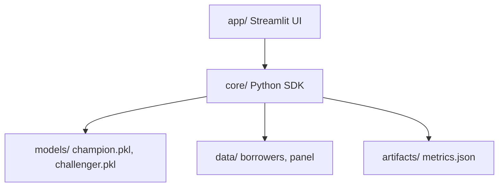

# PS12 - Governed MSME Lending Cockpit
Hackconquest Hackathon, Aether 2026 (TCET Mumbai) - PS 12: Predictive Credit Risk Analytics for MSMEs.

**Problem:** Viable MSMEs are invisible to lenders due to thin credit files. The Indian MSME credit gap is estimated between ₹25 lakh crore (Deloitte, 2025) and ₹60 trillion (Business Standard, Sep 2026).
**Thesis:** Every MSME loan decision (approve, structure or decline) comes with a reason, a route to yes, a fairness cost, and a stress-tested loss number, in one governed workflow.

## Architecture


## Data Statement
This project uses synthetic data generated under documented assumptions to validate the methods. The generator ensures realistic distributions mimicking real MSME characteristics (e.g., thin-file share is 34.6%). See [docs/data_statement.md](docs/data_statement.md) for full methodology.

## How to run
```bash
python -m venv .venv && source .venv/bin/activate
pip install -r requirements-dev.txt
python run_all.py --smoke --keep-going
streamlit run app/Home.py
```

## Results
| Metric | Value | Metrics Key |
|---|---|---|
| 12-month default rate target | 8% | `generator.default_rate_target` |
| Thin-file share (overall) | 34.6% | `generator.thin_file_share_total` |
| OOT AUC (Champion Model) | 0.611 | `models.auc_champion_oot` |
| OOT AUC (Challenger Model) | 0.540 | `models.auc_challenger_oot` |
| Legacy Loss Rate (OOT) | 7.5% | `models.legacy_loss_rate` |
| Extra approvals at equal loss | 20 | `models.extra_approvals_at_equal_loss` |
| Meena Recourse Cost | 15.0 | `recourse.meena_cost` |
| Meena New PD | 0.0661 | `recourse.meena_new_pd` |
| Structuring Lift (matched vs flat) | 28.2% | `structuring.lift_matched_vs_flat` |
| Women-led AIR | 0.9984 | `fairness.women_led_air` |
| Early warning mean lead time | 2.18m | `early_warning.mean_lead_time_months` |
| Trust: Clean firms share | 1.25% | `trust.clean_firms_share` |
| Conformal 80% PI coverage | 88.6% | `forecast.conformal_interval_coverage_80pct` |

## Live URL
[Insert Live App URL Here]

## Video Demo
[Insert Video Demo URL Here]

## Honest limits
Results come from synthetic data under documented assumptions and are method validation, not India-level forecasts. Recourse is a decision aid, not causal. RBI FREE-AI is advisory guidance; we map to it and do not claim compliance.

## Team & Workflow
See [CONTRIBUTING.md](CONTRIBUTING.md), [docs/OWNERSHIP.md](docs/OWNERSHIP.md), [docs/GATES.md](docs/GATES.md). AI agents must follow [AGENTS.md](AGENTS.md).

## Credits & License
- Team: M1, M2, M3, M4
- License: [MIT License Placeholder]
