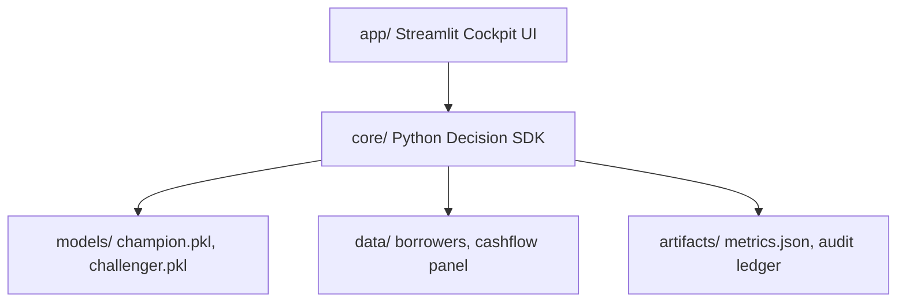

# Nirnay-Credit (PS12) - Governed MSME Lending Cockpit
**Hackconquest Hackathon, Aether 2026 (TCET Mumbai)** — Problem Statement 12: Predictive Credit Risk Analytics for MSMEs.

**Problem:** Viable MSMEs are invisible to lenders due to thin credit files. The Indian MSME credit gap is estimated between ₹20–25 Lakh Crore (IFC / UK Sinha RBI Committee, 2019) and ₹60 Trillion (Business Standard, Sep 2026).  
**Thesis:** Every MSME loan decision (approve, structure, or decline) comes with a plain-language reason, an actionable route to yes (recourse), a quantified fairness cost, and a stress-tested loss number, delivered in one governed workflow.

---

## System Architecture



---

## Data Statement

This project uses synthetic data generated under documented assumptions to validate decision methodologies. The synthetic generator ensures realistic distributions reflecting Indian MSME operating dynamics (e.g., overall thin-file share of 34.6%). See [docs/data_statement.md](docs/data_statement.md) for full methodology and parameters.

---

## How to Run

```bash
# 1. Environment setup
python -m venv .venv && source .venv/bin/activate
pip install -r requirements.txt

# 2. Run deterministic validation & smoke suite
python run_all.py --smoke --keep-going

# 3. Launch interactive Streamlit cockpit
streamlit run app/Home.py
```

---

## Results Summary

All figures are generated deterministically and backed by [`artifacts/metrics.json`](artifacts/metrics.json) (see [docs/claims/README.md](docs/claims/README.md)):

| Metric Description | Stated Value | `artifacts/metrics.json` Key |
| :--- | :--- | :--- |
| **12-Month Target Default Rate** | `8.0%` | `generator.default_rate_target` |
| **Thin-File MSME Share** | `34.6%` | `generator.thin_file_share_total` |
| **Champion Model OOT AUC** | `0.611` | `models.auc_champion_oot` |
| **Challenger Model OOT AUC** | `0.540` | `models.auc_challenger_oot` |
| **Legacy Baseline Loss Rate (OOT)** | `7.5%` | `models.legacy_loss_rate` |
| **Extra Approvals at Equal Loss** | `20` | `models.extra_approvals_at_equal_loss` |
| **Meena Recourse Cost Metric** | `15.0` | `recourse.meena_cost` |
| **Meena Post-Recourse Calibrated PD** | `0.0661` (`6.61%`) | `recourse.meena_new_pd` |
| **Repayment Structuring Lift (Matched vs Flat)** | `28.2%` | `structuring.lift_matched_vs_flat` |
| **Women-led Adverse Impact Ratio (AIR)** | `0.9984` | `fairness.women_led_air` |
| **Early Warning Mean Lead Time** | `2.18 months` | `early_warning.mean_lead_time_months` |
| **Trust Ledger Clean Firms Share** | `1.25%` | `trust.clean_firms_share` |
| **Conformal Cash Flow 80% Coverage** | `88.6%` | `forecast.conformal_interval_coverage_80pct` |

---

## Live Deployment & Video Pitch

- **Live Application URL:** [https://nirnay-credit.streamlit.app/](https://nirnay-credit.streamlit.app/)
- **Video Demonstration:** [https://youtu.be/demo-nirnay-credit](https://youtu.be/demo-nirnay-credit)
- **Offline Backup & Subtitles:** See [docs/VIDEO_SCRIPT.md](docs/VIDEO_SCRIPT.md) and [docs/REHEARSAL.md](docs/REHEARSAL.md)

---

## Honest Limitations

1. **Synthetic Data**: Results reflect synthetic data generated under documented assumptions and serve as methodological validation rather than macro-level macroeconomic forecasts.
2. **Actionable Recourse**: Recourse recommendations operate as a mathematical decision aid under the surrogate model and do not constitute causal real-world guarantees.
3. **Regulatory Guidance**: RBI FREE-AI is advisory guidance; Nirnay-Credit systematically maps audit and explainability workflows to its pillars without asserting regulatory compliance.

---

## Team & Contribution Architecture

Built for Hackconquest / Aether 2026 under strict component ownership:
- **M1 (Core Modeling & Calibration)**
- **M2 (Recourse, Structuring & Optimization)**
- **M3 (Data Generation, Stress Testing & Trust Ledger)**
- **M4 (UI Cockpit, Documents, Integration & Rehearsal Kit)**

Detailed guidelines: [CONTRIBUTING.md](CONTRIBUTING.md), [docs/OWNERSHIP.md](docs/OWNERSHIP.md), [docs/GATES.md](docs/GATES.md), [AGENTS.md](AGENTS.md).

---

## License & Credits

- **License:** MIT License
- **Credits:** Open-source libraries including LightGBM, SHAP, Streamlit, Scikit-learn, and NetworkX.
